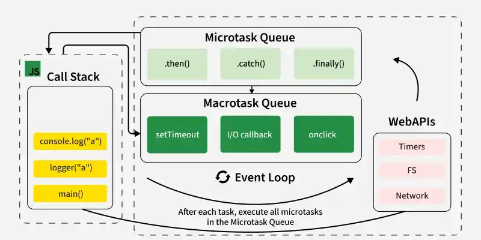

# JS Concepts

### Event Loop 

The event loop is an important concept in JavaScript that enables asynchronous programming by handling tasks efficiently. Since JavaScript is single-threaded, it uses the event loop to manage the execution of multiple tasks without blocking the main thread.


```js
console.log("Start"); // Executes First

setTimeout(() => {
    console.log("setTimeout Callback");
}, 0); // setTimeout schedules its callbacks but does not execute it immediately.

Promise.resolve().then(() => {
    console.log("Promise Resolved");
});

console.log("End");

```

### Working of Event Loop

The event loop continuously checks whether the call stack is empty and whether there are pending tasks in the callback queue or microtask queue.




- Call Stack: JavaScript has a call stack where function execution is managed in a Last-In, First-Out (LIFO) order.
- Web APIs (or Background Tasks): These include setTimeout, setInterval, fetch, DOM events, and other non-blocking operations.
- Callback Queue (Task Queue): When an asynchronous operation is completed, its callback is pushed into the task queue.
- Microtask Queue: Promises (.then(), .catch(), .finally()) and other microtasks are placed here. The microtask queue is always fully executed (drained) before moving to the next macrotask.
- Event Loop: It continuously checks the call stack and, if empty, moves tasks from the queue to the stack for execution.


### Callbacks

Callbacks and events are fundamental building blocks for asynchronous programming in NodeJS. They're important for handling operations that might take some time, ensuring your application handles asynchronous operations smoothly. They are functions that are passed as arguments to other functions and executed when the task completes. This is how NodeJS handles tasks that take time, like getting data from the internet, without making your program wait.


### Closure

A closure is the combination of a function and its lexical environment, allowing the function to access variables from its outer scope even after the outer function has finished executing.

- Retains access to outer function variables.
- Preserves the lexical scope.
- Allows data encapsulation and privacy.
- Commonly used in callbacks and asynchronous code.

```js
function counter(){
    let count = 0; // inner variable cannot be accessed outside the scope

    return function(){
        ++counter;
        return count;
    }

}

const counterFunc = counter();

console.log(counterFunc());
```

### Scope of a Variable in Javascript

####  Global and Local Scope

```js

// Declaring a global variable
let x = 10;

function func() {
    
    // Declaring a local variable
    let y = 20;

    // Accessing Local and Global
    // variables
    console.log(x,",", y);
}

func();

```

#### Block Scope

```js
{
    
    // Var can Accessible inside & outside the block scope 
    var x = 10;
    
    // let , const Accessible only inside the block scope
    const y = 20;
    let z = 30;
    
    console.log(x);
    console.log(y);
    console.log(z);
}

console.log(x);
```

#### Lexical Scope
Lexical scope means a function can access variables from the scope in which it was defined. The scope is determined by the code structure, not by where the function is called.

```js
function func1() {
    const x = 10;

    function func2() {
        const y = 20;
        console.log(`${x} ${y}`);
    }

    func2();
}

func1();

```

### Higher Order function 


